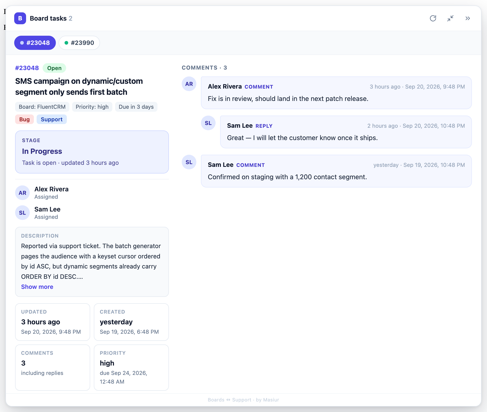

# Boards ↔ Support Tickets

A small Chrome extension that connects **FluentBoards** and **Fluent Support** in the browser — even when the two
plugins live on completely different sites:

- On a **board task**, see the details of every support ticket linked in it.
- On a **support ticket**, see the status of every board task linked in it.

<p align="center">
  
  <br><sub>On a board task: the linked support ticket (sample data)</sub>
</p>

<p align="center">
  
  <br><sub>On a support ticket: the linked board task (sample data)</sub>
</p>

## The use case

- **Site A** runs FluentBoards (your project/task boards).
- **Site B** runs Fluent Support (your support portal).

Tasks on Site A often reference tickets on Site B — a link in the description, a comment, or an attachment like
`https://site-b.com/#/tickets/177567/view`. Normally you'd open every link in a new tab, wait for the portal to load,
read, and switch back.

With this extension, just open the task. Every ticket linked in it is fetched and shown in a drawer next to the task:
title, status, priority, product, tags, customer, assigned agent, timestamps and the full conversation
(customer messages, agent replies and internal notes).

It works the other way round too. Agents often drop a board link into a ticket note, like
`https://site-a.com/projects#/boards/2/tasks/23048-some-task`. Open that ticket on Site B and the drawer shows where the
task stands: title, open/closed, **stage**, labels, assignees, priority and due date, a truncated description, and the
comments with their replies — plus a link to open the task.

No server-side integration, no plugin to install on either site, no API keys to set up —
**if you're logged in to both sites in the same browser, it just works.**

## Features

- On board tasks: detects ticket links in the task description, comments and attachments
- On support tickets: detects board task links anywhere in the ticket (replies, internal notes)
- **Task status at a glance** — stage, open/closed, labels, assignees, truncated description, comments and replies
- **Triage at a glance** — who replied last (customer or support agent) and when, how many times the customer and
  agents have replied, and when the ticket was originally opened (date and time)
- Multiple tickets per task — deduplicated, one tab per ticket, with a dot showing whose move it is
  (amber = customer is waiting, green = waiting on customer)
- Floating right **drawer**: drag its edge to resize, **expand** to a two-column view (summary + conversation),
  or **minimize** to a small launcher that flags tickets waiting for an agent reply (all remembered)
- Readable conversation: customer, agent and internal-note messages are clearly labelled, long messages fold behind "Show more"
- Refresh button to refetch ticket data
- Two auth modes: **browser login** (default, zero config) or **WordPress application password**

## Privacy

- The extension only talks to **your own two sites** (the boards site and the support portal) — nothing else. No analytics, no tracking, no third-party servers.
- It is **read-only**: it fetches ticket and task data and displays it. It never creates, edits or sends anything.
- Settings (and the application password, if you use one) are stored locally in your browser via `chrome.storage.local`.
- Ticket content is rendered as plain text only, never as HTML.

## Install

Download the latest `boards-support-extension-vX.Y.Z.zip` from the
[**Releases**](https://github.com/masiur/Boards-Support-Extention/releases/latest) page and unzip it.

### Chrome, Brave, Edge, Arc (any Chromium browser)

1. Open `chrome://extensions` (Brave: `brave://extensions`) and enable **Developer mode** (top right).
2. Click **Load unpacked** and select the unzipped folder.
3. Reload your FluentBoards and Fluent Support tabs.

To update: download the new release, replace the folder contents, and hit ↻ on the extension card.

### Firefox (128 or newer)

1. Open `about:debugging#/runtime/this-firefox` and click **Load Temporary Add-on…**.
2. Select `manifest.json` inside the unzipped folder.
3. Click the extension's **Options** (or ⋯ → Manage → Options) and press **Grant access to both sites** —
   Firefox does not grant site access automatically.
4. Reload your FluentBoards and Fluent Support tabs.

A temporary add-on is removed when Firefox quits, so repeat the steps after a restart. For a permanent install, Firefox
requires the add-on to be signed: use **Firefox Developer Edition** or **Nightly**, set `xpinstall.signatures.required`
to `false` in `about:config`, zip the folder contents (with `manifest.json` at the top level) and open the zip
in Firefox.

## Authentication

Open the extension's **Options** page. Each site has its own setting:

| Mode | Setup | How it works |
| --- | --- | --- |
| **Browser login** (default) | None — just be logged in to that site in this browser | Uses your existing session cookie + a WordPress REST nonce |
| **Application password** | WP username + an application password (*Users → Profile → Application Passwords*) | Sends HTTP Basic auth to that site's REST API |

## Using it with your own sites

The two sites are currently set for the author's setup. To point it at yours, change:

- `manifest.json` — `content_scripts.matches` and `host_permissions` (both sites)
- `background.js` — the `SITES` constant (both sites)
- `view-tickets.js` and `inject.js` — the ticket link pattern and `TICKET_URL` (Site B)
- `view-tasks.js` — the task link pattern and `taskUrl` (Site A)
- `options.js` — the site names shown on the options page

## Project files

| File | Purpose |
| --- | --- |
| `drawer.js` | Shared drawer: finds linked ids on the page, fetches them, tabs, resize/expand/minimize |
| `view-tickets.js` | Runs on the boards site: renders a support ticket |
| `view-tasks.js` | Runs on the support portal: renders a board task |
| `inject.js` | Page-world hook on the boards site that reads ticket links from task API responses |
| `background.js` | Authenticated read-only requests to both sites' REST APIs |
| `options.html` / `options.js` | Site access (Firefox) and auth settings |
| `dev-test-tickets.html`, `dev-test-tasks.html` | Stubbed pages for UI testing with fake data (`python3 -m http.server`, then open them) |

## Releasing

```bash
git tag v1.1.0 && git push origin v1.1.0
git archive --format=zip --prefix=boards-support-extension/ -o boards-support-extension-v1.1.0.zip v1.1.0
gh release create v1.1.0 boards-support-extension-v1.1.0.zip --title "v1.1.0" --generate-notes
```

Keep the tag in sync with `version` in `manifest.json`.

---

Made by **Masiur**
