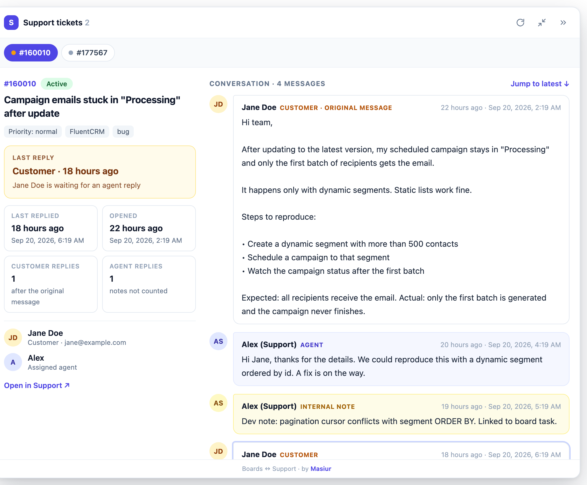

# Boards ↔ Support Tickets

A small Chrome extension that shows **Fluent Support** ticket details right inside your **FluentBoards** task page —
even when the two plugins live on completely different sites.

<p align="center">
  
  <br><sub>The ticket drawer, expanded (sample data)</sub>
</p>

## The use case

- **Site A** runs FluentBoards (your project/task boards).
- **Site B** runs Fluent Support (your support portal).

Tasks on Site A often reference tickets on Site B — a link in the description, a comment, or an attachment like
`https://site-b.com/#/tickets/177567/view`. Normally you'd open every link in a new tab, wait for the portal to load,
read, and switch back.

With this extension, just open the task. Every ticket linked in it is fetched and shown in a drawer next to the task:
title, status, priority, product, tags, customer, assigned agent, timestamps and the full conversation
(customer messages, agent replies and internal notes).

No server-side integration, no plugin to install on either site, no API keys to set up —
**if you're logged in to the support portal in the same browser, it just works.**

## Features

- Detects ticket links in the task description, comments and attachments
- **Triage at a glance** — who replied last (customer or support agent) and when, how many times the customer and
  agents have replied, and when the ticket was originally opened (date and time)
- Multiple tickets per task — deduplicated, one tab per ticket, with a dot showing whose move it is
  (amber = customer is waiting, green = waiting on customer)
- Floating right **drawer**: drag its edge to resize, **expand** to a two-column view (summary + conversation),
  or **minimize** to a small launcher that flags tickets waiting for an agent reply (all remembered)
- Readable conversation: customer, agent and internal-note messages are clearly labelled, long messages fold behind "Show more"
- Refresh button to refetch ticket data
- Two auth modes: **browser login** (default, zero config) or **WordPress application password**

## Privacy

- The extension only talks to **your own support portal** — nothing else. No analytics, no tracking, no third-party servers.
- It is **read-only**: it fetches ticket data and displays it. It never creates, edits or sends anything.
- Settings (and the application password, if you use one) are stored locally in your browser via `chrome.storage.local`.
- Ticket content is rendered as plain text only, never as HTML.

## Install

1. Download the latest `boards-support-extension-vX.Y.Z.zip` from the
   [**Releases**](https://github.com/masiur/Boards-Support-Extention/releases/latest) page and unzip it.
2. Open `chrome://extensions` and enable **Developer mode** (top right).
3. Click **Load unpacked** and select the unzipped folder.
4. Reload your FluentBoards tab.

To update: download the new release, replace the folder contents, and hit ↻ on the extension card.

> Works in any Chromium browser (Chrome, Edge, Brave, Arc…).

## Authentication

Open the extension's **Options** page to choose:

| Mode | Setup | How it works |
| --- | --- | --- |
| **Browser login** (default) | None — just be logged in to the support portal in this browser | Uses your existing session cookie + a WordPress REST nonce |
| **Application password** | WP username + an application password (*Users → Profile → Application Passwords*) | Sends HTTP Basic auth to the Fluent Support REST API |

## Using it with your own sites

The two sites are currently set for the author's setup. To point it at yours, change:

- `manifest.json` — `content_scripts.matches` (Site A, FluentBoards) and `host_permissions` (Site B, Fluent Support)
- `background.js` — the `SUPPORT` constant (Site B)
- `content.js` and `inject.js` — the `TICKET_RE` pattern and `TICKET_URL` (Site B ticket links)

## Project files

| File | Purpose |
| --- | --- |
| `content.js` | Finds ticket ids on the page and renders the drawer |
| `inject.js` | Page-world hook that reads ticket links from FluentBoards task API responses |
| `background.js` | Authenticated requests to the Fluent Support REST API |
| `options.html` / `options.js` | Auth settings |
| `dev-test.html` | Stubbed page for UI testing (`python3 -m http.server`, then open `/dev-test.html`) |

## Releasing

```bash
git tag v0.3.0 && git push origin v0.3.0
git archive --format=zip --prefix=boards-support-extension/ -o boards-support-extension-v0.3.0.zip v0.3.0
gh release create v0.3.0 boards-support-extension-v0.3.0.zip --title "v0.3.0" --generate-notes
```

Keep the tag in sync with `version` in `manifest.json`.

---

Made by **Masiur**
